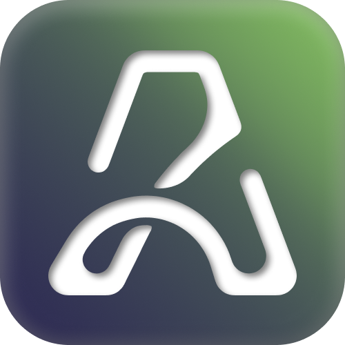
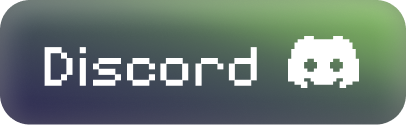

<!-- TODO: Add an image here above, visual illustration. -->

# Agora

  <h3>Building versatile tooling for edtech, social media, and more.</h3>
  
  
   
   
  

    Agora is an ecosystem of tools and technologies that are useful in
    many domains: From edtech, to social media, and beyond.
  

   
  <a href="#lussia">Explore Lussia</a>
  |
  <a href="#contrasture">Explore Contrasture</a>
  |
  <a href="#contributing">Contributing</a>
  |
  <a href="#community">Community</a>

## Lussia

Lussia is an AI-powered content aggregator, and learning companion designed
to help students learn more effectively by curating and presenting information
in a personalied manner.

> **TODO**: Add more information about Lussia.

## Contrasture

Contrasture is an agent context platform designed to implement
unlimited context awareness by replacing traditional vector-based
retrieval with ZetellKasten-based knowledge graphs.

> **TODO**: Add more information about Contrasture.

## Contributing

> [!NOTE]
> **Proprietary Program:** Some of our products may be closed-source
> and proprotiary. If you are interesting in projects we have released
> that arent entirely open source, consider joining our core team!
> Apply via our careers page.

Contribitons within Agora are always welcome! Whether you are fixing
bugs within an open sourced repo, or suggesting a new feature, you
are actively shaping our ecosystem to be better for you and many
others.

To get started, consider the following:

- Read our contribution guidelines: [CONTRIBUTING.md](../.github/CONTRIBUTING.md)
- Review community expectations: [CODE_OF_CONDUCT.md](../.github/CODE_OF_CONDUCT.md)
- Report any security issues responsibly: [SECURITY.md](../.github/SECURITY.MD)

## Community

Our community is a dedicated space for software engineers and life long
learners who are looking to collaborate, share knowledge, and build
tools that improve the world one step at a time. By participating with
our community, you will gain access to an abundance of resources, best
practices, and tools that might help you in your daily life!

Additionally, if you would like to know what we are upto, consider
joining us on discord and following our twitter for updates!

<h3 align="left">
   
</h3>

## Other Questions & Concerns

If you have any other questions or concerns regarding our work at Agora,
consider writing to us at: [contact@agoraedu.com](mailto:contact@agoraedu.com).
